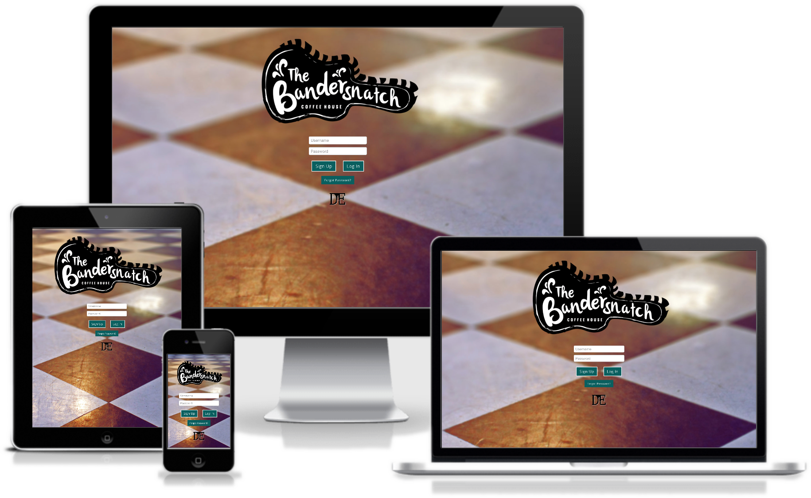

# Bandersnatch WebApp

## A Little About The WebApp

This project was built to remedy a problem with Denison University's on-campus coffeehouse, The Bandersnatch. The Bandersnatch struggles with turning a profit and using data to properly plan when purchasing food supplies for their kitchen. Therefore, this webapp serves as a point-of-sale system and data management tool for Bandersnatch employees, managers, consultants, and auditors.

The Bandersnatch App is built with the Meteor.js framework on top of Node.js. As with most Meteor web applications, it uses a MongoDB database and is written with JavaScript on the client and server sides.

## How to Run Locally

To get started do the following:

- First, ensure that you have Meteor on your computer.
  - [Install on MacOS/Linux](https://install.meteor.com/)
    - Or run `curl https://install.meteor.com/ | sh` in your terminal (you may have to use `sudo` with this command)
  - [Install on Windows](https://install.meteor.com/windows)

- If you're working in git:
  - move to the directory you want to locally store the webapp in
  - run `git clone https://github.com/DE-Dev-Team/snatch.git` to clone this git repo to your current directory
  - once the clone is finished, `cd` into the "snatch" directory
  - continue to the next section
  
- If you're downloading a ZIP file:
  - [Click here](https://github.com/DE-Dev-Team/snatch/archive/master.zip) or go to the repo page and click download zip.
  - Unzip the file
  - `cd` into the unzipped directory
  - continue to the next section

- Finally...
  - run the command `meteor` in the terminal
  - navigate to the URL given (usually defaults to `http://localhost:3000`)
